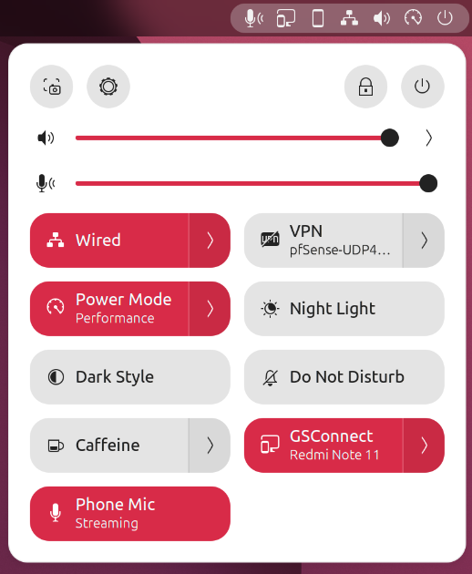

# Android phone as a microphone for Linux

Turns an Android phone into a normal microphone for any Linux computer — desktop or laptop, with or without a built-in mic.
The phone shows up as an input device called **"Phone Mic"** in every app: dictation, WhatsApp, Discord, browsers, Zoom, recorders.

Most useful on a **desktop that has no microphone at all** (that is where this came from), but just as usable on a laptop whose
built-in mic is poor: Phone Mic is simply one more input to choose, and the built-in one stays as it is.

- **Nothing to install on the phone.** Uses Android's built-in debugging link (adb) and [scrcpy](https://github.com/Genymobile/scrcpy).
- **USB cable or Wi-Fi.** Same home network is enough. USB is used when plugged in, Wi-Fi otherwise.
- **Zero-touch after setup.** Starts at login, reconnects by itself when the phone comes and goes, survives computer reboots.
- **Does not interfere** with anything else: the phone works normally (calls, apps, screen off); the computer's sound output, headphones and other mics stay as they were. Nothing system-wide is changed on the computer (no sudo, nothing runs as root, all per-user).
- **One click to cut the mic** for privacy: a tile in GNOME's Quick Settings menu (or `phone-mic off`).

<p align="center"></p>

*The top-right menu on Ubuntu 26.04 LTS: the **Phone Mic** tile shows Off / Waiting for phone / Streaming and toggles the mic with one click.
While streaming, a small phone icon sits in the top bar.*

## Compatibility — what is tested and what is not

**Tested:** Ubuntu 26.04 LTS with GNOME (PipeWire 1.6, WirePlumber 0.5, scrcpy 3.3) and a Redmi Note 11 (HyperOS 1.0, Android 13). That is the only combination anyone has run this on so far.

What the setup needs, and therefore where it should work (untested unless marked):

| Requirement | Why | Distros / desktops |
|---|---|---|
| **PipeWire + WirePlumber** as the audio server | the virtual mic is a PipeWire loopback; the scrcpy stream is pinned with PipeWire properties | Ubuntu 22.10+, Fedora 34+, Arch, openSUSE, Debian 12+, Manjaro... — *not* a system still on plain PulseAudio |
| **systemd** user services | the three services | any systemd distro — *not* Void, Alpine, Devuan, Gentoo/OpenRC |
| **scrcpy ≥ 2.1** with audio support | `--audio-source=mic` | Ubuntu 24.04+ ✔ (tested on 26.04), Arch/Manjaro ✔, Fedora via [scrcpy's install docs](https://github.com/Genymobile/scrcpy/blob/master/doc/linux.md), **Debian 12's scrcpy 1.25 is too old** (build from source or use a newer package) |
| **adb** (android-tools) | the phone link | all distros. On Arch also install `android-udev` for USB access; Debian/Ubuntu ship the udev rules with adb |
| `pactl`, `parecord`, `paplay` | default-input handling and `phone-mic test` | package `pulseaudio-utils` (Debian/Ubuntu/Fedora) or `libpulse` (Arch), plus `pipewire-pulse` |
| **Android 11+** on the phone | mic capture over adb | any brand; Xiaomi/HyperOS is what was tested |

Desktop environments: the mic itself is desktop-agnostic. The **Quick Settings tile is GNOME 48–50 only**. On KDE Plasma,
Cinnamon, XFCE, Sway, etc. use the `phone-mic` commands, the app-grid launcher, or a keyboard shortcut for `phone-mic toggle`
(notifications still appear). `install.sh` skips the tile when GNOME Shell is not present.

If you run this on another distro or desktop, please open an issue with the result — the table above will be updated.

## 1. Install (computer)

```bash
# Ubuntu 24.04+ / Debian 13+
sudo apt install adb scrcpy pipewire-bin pulseaudio-utils git
# Arch / Manjaro (untested):  sudo pacman -S android-tools android-udev scrcpy pipewire pipewire-pulse wireplumber libpulse git
# Fedora (untested):          sudo dnf install android-tools pipewire-utils pulseaudio-utils git   + scrcpy from its install docs

git clone https://github.com/sharjeelmazhar/phone-mic.git ~/Code/Mic-Setup
cd ~/Code/Mic-Setup
./install.sh
```

`install.sh` copies two scripts to `~/.local/bin`, three user services to `~/.config/systemd/user`, a launcher to the app grid
and, on GNOME, a small Quick Settings extension, then starts everything. No sudo, nothing system-wide. Re-run it any time; it is safe.
`./uninstall.sh` removes all of it.

After the first install, **log out and back in once**: that puts `phone-mic` on your PATH and loads the GNOME tile
(top-right menu → **Phone Mic**: shows Off / Waiting for phone / Streaming, click to toggle; a phone icon sits in the top bar while streaming).

## 2. Enable USB debugging (phone, one time)

Generic Android: Settings → About phone → tap **Build number** 7 times → Settings → System → Developer options.

Xiaomi / Redmi / POCO (HyperOS or MIUI): Settings → About phone → tap **OS version** (MIUI: *MIUI version*) 7 times
→ Settings → **Additional settings → Developer options**.

In Developer options:

| Setting | Set to | Why |
|---|---|---|
| **USB debugging** | ON | required |
| **Disable adb authorisation timeout** | ON | otherwise Android forgets the computer after 7 days without use and asks again |
| USB debugging (Security settings) *(Xiaomi only)* | optional | only for controlling the phone with mouse/keyboard in scrcpy; not needed for the mic |
| Install via USB, Wireless debugging | leave OFF | not needed |

## 3. Pair (one time)

1. Plug the phone into the computer with a USB **data** cable and unlock the phone.
2. Phone shows **"Allow USB debugging?"** → tick **Always allow from this computer** → **Allow**.
3. On the computer: `phone-mic status` should say `phone audio IS flowing into Phone Mic`.
4. `phone-mic default` makes Phone Mic the default input. `phone-mic test` records 5 s and plays it back.

While the phone is on USB, the setup also switches on adb-over-Wi-Fi on the phone and remembers its IP address.
**You can now unplug the cable.** The mic keeps working over Wi-Fi.

## 4. Daily use — what happens when

| Situation | What happens | You do |
|---|---|---|
| Computer restarts / you log in | services start, phone is found over Wi-Fi (or USB) within seconds | nothing |
| Phone plugged in via USB | streams over USB (most reliable; also charges) | nothing |
| Cable unplugged | drops for ~5 s, continues over Wi-Fi | nothing |
| Phone leaves the house / Wi-Fi off / battery dead | noticed within ~7 s (the phone stops answering), tile shows *Waiting for phone*; service keeps waiting quietly | nothing; it resumes when the phone is back |
| Phone **rebooted** | Android forgets adb-over-Wi-Fi (a security feature, cannot be avoided) | plug USB in for ~5 s once, then unplug |
| Phone gets a **new IP address** from the router | Wi-Fi connect fails | plug USB in for ~5 s once; or give the phone a fixed IP in the router so this never happens |
| Computer suspended and resumed | stale connection is detected, stream restarts | nothing |
| PipeWire / audio restarts on the computer | watchdog notices the lost link within 5 s and restarts the stream | nothing |
| Phone screen off / locked | keeps streaming (Android shows the green mic dot). If it has to *re*connect while the phone sleeps, Wi-Fi power-save can delay that by up to a minute | nothing |
| Phone call on the phone | Android gives the call priority; the stream may go silent during the call and resumes after | nothing |
| Headphones plugged into the computer | sound output switches to headphones as usual; input stays Phone Mic | nothing |
| Want the wired headset mic instead | | Settings → Sound → Input → pick it; `phone-mic default` to switch back |
| Want the mic **off** (privacy, battery) | | Quick Settings tile **Phone Mic** (GNOME), `phone-mic off`, or the app-grid launcher "Phone Mic (on/off)" |
| Mic off, want it back | | `phone-mic on` |
| Never want it to start by itself | | `phone-mic disable` (then `phone-mic on` when needed; `phone-mic enable` to go back to automatic) |
| Using scrcpy for screen mirroring at the same time | both work together, also over Wi-Fi | `scrcpy` as usual; `scrcpy -e` = Wi-Fi, `scrcpy -d` = USB when both exist |
| Another Android device plugged into the computer | the script may pick it | set `PHONE_SERIAL` in the config (see below) |
| Reinstalled the computer | new adb key → phone asks "Allow USB debugging?" again | steps 1 and 3 |
| USB debugging turned **off** on the phone (some banking apps insist) | mic stops; computer side just waits | turn it back on afterwards; if Wi-Fi mode doesn't return within a minute, plug USB once |
| **Switch to another phone** | only one phone streams at a time | see *Switching to another phone* below — no restarts of anything |

### Laptops / computers that already have a microphone

Everything above works the same; the only question is which input is the *default*. The setup never changes the default input by
itself, so a laptop keeps its built-in mic as default and **Phone Mic is simply one more input** to pick in Settings → Sound → Input or
inside the app (Zoom, Discord, browser...). The choice is remembered across reboots.

- Desktop without a mic (this repo's origin): run `phone-mic default` once, Phone Mic stays the default forever.
- Laptop, want the phone whenever it is around and the built-in mic otherwise: set `AUTO_DEFAULT=1` in the config.
  Phone Mic becomes the default input only while the phone is streaming; when it stops, the previous input is restored.
  (If you pick a different input yourself in the meantime, it is left alone.)

### Switching to another phone

No reboot of the computer or of either phone. Only one phone streams at a time; the phone that is present when streaming
starts is used, USB before Wi-Fi.

1. On the other phone, enable USB debugging once (section 2).
2. Turn the mic off: the **Phone Mic** tile, or `phone-mic off`. This releases the current phone, including its Wi-Fi link.
3. Plug the other phone in, unlock it, accept "Allow USB debugging?" with *Always allow*.
4. Turn the mic on again: the tile, or `phone-mic on`. It streams from the new phone over USB; unplug the cable and it
   continues over Wi-Fi (its address was saved while on USB).

Switching back is the same four steps with the first phone. If two phones with debugging on are plugged in at the same time,
set `PHONE_SERIAL` in the config to say which one to use.

### Privacy

While streaming, **anyone at the computer can record what the phone hears**, wherever the phone is. That is the whole point,
but remember it when you carry the phone around. `phone-mic off` stops it instantly (the green dot on the phone disappears);
`phone-mic on` resumes. A stopped mic stays stopped until you turn it on or log in again; `phone-mic disable` makes "off" permanent.

Wi-Fi mode leaves adb listening on port 5555 on the phone while it is on your Wi-Fi. Connections still need the computer's
authorised key, so other devices on the network cannot use it. Prefer USB only? Set `WIFI=0` in the config.

## 5. Commands

```
phone-mic status     services, adb devices, default input, streaming or not
phone-mic on / off   start / stop streaming now
phone-mic toggle     same, for a keyboard shortcut (Settings → Keyboard → Custom Shortcuts → command: phone-mic toggle)
phone-mic enable / disable   automatic start at login on / off
phone-mic state      one word: off | waiting | streaming (used by the GNOME tile)
phone-mic default    make Phone Mic the default input device
phone-mic test       record 5 s, show level, play back
phone-mic log        recent log lines
phone-mic doctor     status + log — paste this when asking for help
```

Config: `~/.config/phone-mic/config` (created from `config.example`). Options: `AUDIO_SOURCE` (`mic`, `mic-voice-communication`
for noise suppression, `mic-voice-recognition` for dictation), `AUDIO_BUFFER` (ms, raise to 150 if Wi-Fi crackles),
`WIFI` (0/1), `PHONE_ADDR` (fixed ip:5555), `PHONE_SERIAL`, `AUTO_DEFAULT` (0/1, see *Laptops*). After editing: `phone-mic off && phone-mic on`.

## 6. Troubleshooting

| Symptom | Fix |
|---|---|
| `adb devices` empty with cable plugged in | charge-only cable or bad port: try another cable/port; check USB debugging is ON |
| `unauthorized` in `phone-mic status` | unlock the phone and accept the prompt. No prompt? Developer options → *Revoke USB debugging authorisations*, replug |
| Works on USB, not on Wi-Fi | phone rebooted or IP changed → plug USB once. Phone on a different network (guest Wi-Fi, mobile data)? Router isolates Wi-Fi from Ethernet ("AP isolation")? |
| Crackles / drop-outs on Wi-Fi | `AUDIO_BUFFER=150` in the config, or use USB |
| App hears nothing | pick **Phone Mic** in the app or in Settings → Sound → Input; check input volume isn't 0; `phone-mic test` |
| "Phone Mic" missing from the input list | `systemctl --user restart phone-mic-device` |
| Phone audio comes out of the speakers | must not happen (stream is pinned to the virtual mic and refuses to fall back). `phone-mic off && phone-mic on`, then `phone-mic doctor` |
| Stream dies after minutes with screen off | phone battery saver killing adb: Settings → Battery → keep it off for now, or keep the phone charging |
| Delay too high | it is ~50–100 ms; for lower use USB and `AUDIO_BUFFER=30` |
| Anything else | `phone-mic doctor`; full output of a manual run: `phone-mic off; ~/.local/bin/phone-mic-stream` |

## Tested

| Scenario | Result |
|---|---|
| Computer reboot, phone untouched | back over Wi-Fi by itself, ~20 s after login |
| Router + computer + phone all powered off and on | needs the one cable plug (phone reboot); the phone's **changed IP** was picked up automatically |
| Cable unplugged while streaming | 4 s gap, continues over Wi-Fi |
| Wired headphones plugged in / out | output follows the headphones, input stays Phone Mic; switching to the headset mic and back works |
| Virtual mic or PipeWire restarted while streaming | stream re-attached within ~5 s, never touched the speakers |
| Stream forced onto the speakers (`pw-link`) | killed within 1 s, back on Phone Mic after 3 s |
| scrcpy screen mirroring at the same time, over Wi-Fi | both run together |
| Phone's Wi-Fi switched off while streaming | noticed within ~7 s → *Waiting for phone*; streaming again 9–16 s after Wi-Fi is back on |
| `phone-mic off` / `on` | stops instantly / streaming again within ~3 s |
| Not yet tested | computer suspend/resume; phone screen off for >10 min while streaming; switching between two phones |

## How it works

```
phone mic ─(adb over USB or Wi-Fi)─> scrcpy --audio-source=mic ─> phone_mic_in ─(pw-loopback)─> "Phone Mic" source ─> apps
```

| Part | Job |
|---|---|
| `adb-server.service` | the adb server, in its own unit so mic restarts never kill your own scrcpy/adb sessions |
| `phone-mic-device.service` | `pw-loopback`: an input stream `phone_mic_in` (invisible to apps, so nothing appears under *Output*) feeding the virtual source `phone_mic` ("Phone Mic") |
| `phone-mic.service` → `phone-mic-stream` | finds the phone (USB first, then Wi-Fi), enables `adb tcpip 5555` and saves the phone IP while on USB, runs `scrcpy --no-video --audio-source=mic` with SDL's PipeWire output pinned to `phone_mic_in` (`node.dont-move`, `node.dont-fallback`), three watchdogs (kills the stream within 1 s if it is ever linked to anything but `phone_mic_in`; restarts it if the link is lost; over Wi-Fi asks the phone for a reply every 4 s and gives up after 3 s of silence), exits so systemd retries when the phone goes away |

`LOG.md` records the setup session, including the dead ends (virtual sinks show up as output devices; the PulseAudio API
cannot target a stream; streams do not re-link after a loopback restart) for anyone adapting this.

## Uninstall

`./uninstall.sh` — removes the services, scripts, launcher and the GNOME tile. Then on the phone: Developer options → USB debugging OFF
(and *Revoke USB debugging authorisations* if you like).
