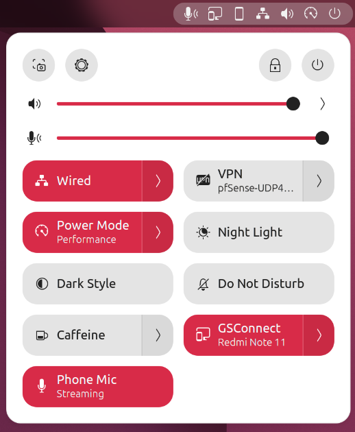
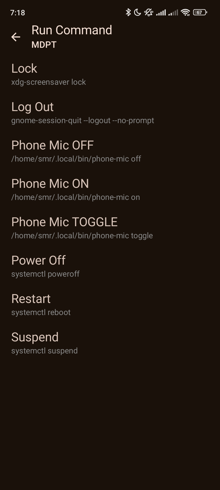
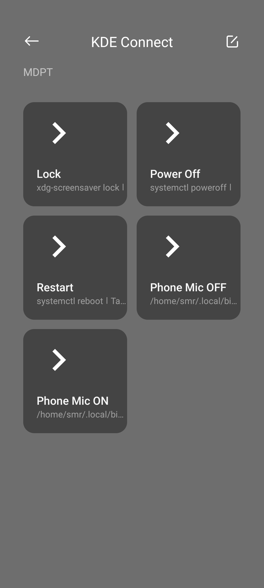

# Android phone as a microphone for Linux

Turns an Android phone into a normal microphone for any Linux computer — desktop or laptop, with or without a built-in mic.
The phone shows up as an input device called **"Phone Mic"** in every app: dictation, WhatsApp, Discord, browsers, Zoom, recorders.

Most useful on a **desktop that has no microphone at all** (that is where this came from), but just as usable on a laptop whose
built-in mic is poor: Phone Mic is simply one more input to choose, and the built-in one stays as it is.

- **Wireless, like KDE Connect / GSConnect.** A small app on the phone, the computer finds it on the home network by itself.
  **No cable, no developer options, no USB debugging** — banking apps that refuse to run with developer options on keep working.
- **Zero-touch after a one-time pairing.** Starts at login, keeps looking for the phone every few seconds, reconnects by itself
  when the phone comes back: computer reboot, router reboot, new IP address, phone switching between your Wi-Fi networks or bands.
- **Pairing in one scan.** `phone-mic pair` shows a QR code, the app scans it, done. (Or compare a 6-digit code and tap Allow.)
- **Private.** Only paired computers get the mic, the audio is encrypted on the network, and the phone's microphone is only
  switched on while a paired computer is actually listening — Android's green microphone dot shows exactly when.
- **Does not interfere** with anything else: the phone works normally (calls, apps, screen off); the computer's sound output,
  headphones and other mics stay as they were. Nothing runs as root on the computer.
- **Updates with the system.** On Ubuntu / Debian it is a `.deb` with its own apt repository: `sudo apt update && sudo apt upgrade`
  brings new versions.
- **One click to cut the mic** for privacy: a tile in GNOME's Quick Settings menu (or `phone-mic off`), or *Turn off* on the phone.

<p align="center"></p>

*The top-right menu on Ubuntu 26.04 LTS: the **Phone Mic** tile shows Off / Waiting for phone / the pairing code / Streaming and
toggles the mic with one click. While streaming, a small phone icon sits in the top bar.*

## Compatibility — what is tested and what is not

**Tested:** Ubuntu 26.04 LTS with GNOME (PipeWire 1.6, WirePlumber 0.5) and a Redmi Note 11 (HyperOS 1.0, Android 13).
The app also runs in the Android 15 emulator. Version 1 of the package (install, upgrade through apt, removal, tile) was checked in clean
virtual machines of Ubuntu 26.04 (GNOME 50) and Ubuntu 24.04 (GNOME 46); the computer side of version 2 only needs less than that.

| Requirement | Why | Where |
|---|---|---|
| **PipeWire + WirePlumber** as the audio server | the virtual mic is a PipeWire loopback; the phone's audio is played into it with `pw-cat` | Ubuntu 22.10+, Fedora 34+, Arch, openSUSE, Debian 12+, Manjaro... — *not* a system still on plain PulseAudio |
| **systemd** user services | the two services | any systemd distro — *not* Void, Alpine, Devuan, Gentoo/OpenRC |
| **Python 3.9+** | the daemon that talks to the phone (standard library only) | everywhere |
| `pactl`, `parecord`, `paplay` | default-input handling and `phone-mic test` | `pulseaudio-utils` (Debian/Ubuntu/Fedora) or `libpulse` (Arch), plus `pipewire-pulse` |
| **Android 8 or newer** on the phone | the app | any brand; Xiaomi/HyperOS is what was tested |
| phone and computer on the **same home network** | the phone is found by its announcements, its last address and a scan of the local network | Wi-Fi or cable on the computer side; both bands of a router are fine |

Desktop environments: the mic itself is desktop-agnostic. The **Quick Settings tile is for GNOME 45–51**. On KDE Plasma, Cinnamon,
XFCE, Sway, etc. use the `phone-mic` commands, the app-grid launcher, or a keyboard shortcut for `phone-mic toggle` (notifications
still appear). If you run this on another distro or desktop, please open an issue with the result.

## 1. Install on the computer

### Ubuntu / Debian: the `.deb`

```bash
wget https://github.com/sharjeelmazhar/phone-mic/releases/latest/download/phone-mic.deb
sudo apt install ./phone-mic.deb
```

That is the whole installation. The package sets the mic up right away for whoever is logged in (other users of the computer get
it at their next login): both services are started and switched on for every login, the launcher is in the app grid, the GNOME tile
is enabled, and KDE Connect buttons are added if GSConnect and a paired phone are there. It also adds Phone Mic's own apt
repository, so later versions arrive with the rest of your updates; a running mic restarts by itself with the new version.

**Log out and back in once** after the first install: GNOME only notices a newly installed tile at login.

Upgrading from version 1 (adb + scrcpy)? `sudo apt upgrade` does it. The old adb service is removed; install the phone app (next
step) and pair once. USB debugging and developer options can then be switched off on the phone.

### Other distros: `install.sh`

```bash
# Arch / Manjaro (untested):  sudo pacman -S pipewire pipewire-pulse wireplumber libpulse python git
# Fedora (untested):          sudo dnf install pipewire-utils pulseaudio-utils python3 git
git clone https://github.com/sharjeelmazhar/phone-mic.git
cd phone-mic
./install.sh
```

`install.sh` copies everything into your home folder (`~/.local/bin`, `~/.config/systemd/user`, the GNOME tile) and starts it. No
sudo. Updating means `git pull` and `./install.sh` again. Log out and back in once afterwards.

## 2. Install the app on the phone

Open this link on the phone (or scan the QR code that `phone-mic app` prints on the computer):

**https://sharjeelmazhar.github.io/phone-mic/PhoneMic.apk**

It is also attached to every [release](https://github.com/sharjeelmazhar/phone-mic/releases). Android asks to allow installing apps
from the browser once; Google Play Protect may say the app is unknown to it (it is not in the Play Store): *Install anyway*.

Open **Phone Mic** and allow the microphone. It switches itself on. The **Finish setup** card lists what is still missing for
"always on, also after a reboot"; each item has a button that opens the right settings page, and the card disappears when all is done:

| Item | Why |
|---|---|
| **Run in the background** (battery: unrestricted) | otherwise Android stops the app to save battery |
| **Start by itself after a restart** ("Display over other apps") | Android only gives the microphone to an app that was opened; after a reboot Phone Mic opens itself for a split second, invisibly |
| **Xiaomi / Redmi / POCO: Autostart** and "Display pop-up windows while running in the background" | HyperOS / MIUI never restarts an app without them (Settings → Apps → Manage apps → Phone Mic) |
| **Hide the notification** (Android 13+, recommended) | Android shows its own green microphone dot while the computer listens; with Phone Mic's notifications off it stays out of the shade and the lock screen and works the same |

## 3. Pair (one time)

On the computer:

```bash
phone-mic pair
```

It shows a QR code. In the app tap the **QR button** and scan it (the phone's camera app works too). Paired and streaming within
a couple of seconds, nothing to confirm: the code itself proves it is your computer.

Without the QR code: the very first phone also pairs by itself. The app shows a 6-digit code, the computer shows the same
(notification, the Phone Mic tile, `phone-mic status`); tap **Allow** if they match.

`phone-mic default` makes Phone Mic the default input. `phone-mic test` records 5 s and plays it back.

## 4. Daily use — what happens when

| Situation | What happens | You do |
|---|---|---|
| Computer restarts / you log in | services start, phone is found within seconds | nothing |
| Router restarts, phone gets a **new IP address** | phone found again by its announcements or the network scan | nothing |
| Phone switches to your **other Wi-Fi network / band** and back | noticed within ~5 s, *Waiting for phone*; streaming again a few seconds after it is reachable | nothing |
| Phone leaves the house / Wi-Fi off / battery dead | noticed within ~5 s; the computer keeps looking every few seconds | nothing; it resumes when the phone is back |
| Phone **rebooted** | the app restarts itself (needs the *Finish setup* items; without them a notification asks for one tap) | nothing |
| App swiped away / killed by the system | restarted by the system or by its 15-minute watchdog | nothing |
| Phone screen off / locked | keeps streaming; nothing on the lock screen | nothing |
| Phone streaming to another paired computer | the second computer waits until the phone is free | nothing |
| Phone call on the phone | Android gives the call priority; the stream may go silent during the call and resumes after | nothing |
| Headphones plugged into the computer | output switches to headphones as usual; input stays Phone Mic | nothing |
| Want the wired headset mic instead | | Settings → Sound → Input → pick it; `phone-mic default` to switch back |
| Want the mic **off** (privacy, battery) | | the **Phone Mic** tile, `phone-mic off`, the launcher "Phone Mic (on/off)", or *Turn off* in the app |
| Never want it to start by itself | | `phone-mic disable` (`phone-mic on` when needed; `phone-mic enable` to go back to automatic) |
| **Another phone** | only one phone streams at a time; the first paired phone that is found is used | `phone-mic pair` and scan; *Turn off* the app on the phone you do not want to use |

### Laptops / computers that already have a microphone

The setup never changes the default input by itself, so a laptop keeps its built-in mic as default and **Phone Mic is simply one
more input** to pick in Settings → Sound → Input or inside the app. The choice is remembered.

- Desktop without a mic (this repo's origin): run `phone-mic default` once; Phone Mic stays the default.
- Laptop, phone whenever it is around and the built-in mic otherwise: `AUTO_DEFAULT=1` in the config.
- Phone Mic must stay the default even when a headset is plugged in: `KEEP_DEFAULT=1`.

### Cut the mic from the phone itself

*Turn off* in the app or in its notification. With [GSConnect](https://extensions.gnome.org/extension/1319/gsconnect/) (GNOME) or
KDE Connect and a paired phone, the install also adds **Phone Mic ON / OFF / TOGGLE** to the phone's **KDE Connect → Run Command**
list, which also fits into the KDE Connect tile of Android's quick-settings panel.

<p align="center">
&nbsp;&nbsp;

</p>

`phone-mic kdeconnect` adds them later (safe to repeat), `phone-mic kdeconnect remove` takes them out.

### Privacy and security

While streaming, **anyone at the computer can record what the phone hears**, wherever the phone is. That is the whole point,
but remember it when you carry the phone around. *Turn off* in the app or `phone-mic off` stops it instantly (the green dot on
the phone disappears).

- Pairing is a Diffie-Hellman key exchange; the QR code's secret (or comparing the 6-digit code) makes sure nobody in the middle took part. Each later
  connection proves knowledge of the shared key in both directions, and the audio is encrypted with a key that is new every time.
- The app only gives its microphone to computers that were allowed on the phone, and records only while one of them is connected.
  *Forget* in the app (or `phone-mic forget <phone>` on the computer) removes a pairing.
- After the first phone is paired, new phones can only pair within 5 minutes of `phone-mic pair`; while its QR code is shown,
  only the phone that scanned it pairs.
- The app listens on TCP port 47630 and announces itself on UDP port 47631, on the local network only.

## 5. Commands

```
phone-mic status     services, state, paired phones, default input
phone-mic on / off   start / stop streaming now
phone-mic toggle     same, for a keyboard shortcut (Settings → Keyboard → Custom Shortcuts → command: phone-mic toggle)
phone-mic enable / disable   automatic start at login on / off
phone-mic state      off | waiting | pairing <code> | streaming (used by the GNOME tile)
phone-mic app        link and QR code for the phone app
phone-mic pair       QR code to scan with the app (pairs a phone; 5 minutes)
phone-mic phones     paired phones
phone-mic forget <phone name or id> | all
phone-mic default    make Phone Mic the default input device
phone-mic test       record 5 s, show level, play back
phone-mic log        recent log lines
phone-mic doctor     status + log — paste this when asking for help
phone-mic kdeconnect [add|remove]   buttons in the phone's KDE Connect app
phone-mic setup      repeat the per-user setup; the installation runs it for you
phone-mic uninstall  remove everything, including the package
phone-mic version    the installed version
```

Config: `~/.config/phone-mic/config` (created from `config.example`). Options: `AUDIO_SOURCE` (`mic`, `voice-communication` for
the phone's noise suppression, `voice-recognition` for dictation, `unprocessed`), `BUFFER_MS` (raise if the sound drops out on bad
Wi-Fi), `PHONE_ADDR` (fixed phone IP, normally not needed), `SCAN` (0 = never scan the local network), `AUTO_DEFAULT`,
`KEEP_DEFAULT`. After editing: `phone-mic off && phone-mic on`.

## 6. Troubleshooting

| Symptom | Fix |
|---|---|
| Works on one Wi-Fi of the router but not the other (e.g. "Home" vs "Home 5G") | the router keeps that Wi-Fi apart from the computer ("AP / SSID isolation"): nothing gets through, KDE Connect neither. Turn the isolation off in the router, or use the other Wi-Fi. When the phone comes back to a network that works, it reconnects by itself within seconds |
| Stays on *Waiting for phone* | is the app switched on (its notification says *On, waiting for the computer*)? Same network? Guest Wi-Fi or a router with "AP isolation" keeps devices apart. A VPN on the phone may hide it. Try `PHONE_ADDR=<phone IP>` in the config |
| Pairing does not happen | run `phone-mic pair` and scan its code in the app. Denied a code by mistake? It asks again after 10 minutes, or right away after `phone-mic off && phone-mic on` |
| Stops after a while with the screen off | battery restrictions: *Allow running in the background* in the app; on Xiaomi also Autostart and *No restrictions* |
| Not back after a phone reboot | open the app: the *Finish setup* card shows what is missing (Xiaomi: Autostart) |
| Drop-outs | `BUFFER_MS=250` in the config; a 5 GHz network helps |
| App hears nothing | pick **Phone Mic** in the app or in Settings → Sound → Input; check input volume; `phone-mic test` |
| "Phone Mic" missing from the input list | `systemctl --user restart phone-mic-device` |
| `phone-mic status` ends with a `PROBLEM:` line | it names what is missing on the computer |
| Anything else | `phone-mic doctor`; the phone side logs to `adb logcat -s PhoneMic` if you have adb |

## Tested

| Scenario | Result |
|---|---|
| Fresh phone app, computer finds it with no address configured | found by its announcements, by GSConnect's link and by the network scan (1.2 s for a /24) |
| Pairing by code | the same code on both, *Allow* on the phone, streaming 1 s later |
| Pairing by QR code (`phone-mic pair`) | the phone stays quiet until it scanned the code, then paired and streaming 1.3 s after the scan |
| Real phone microphone over Wi-Fi | continuous audio, nothing lost over 6 s of speech |
| Phone Wi-Fi switched off while streaming, back on after 8 s | noticed in 5 s; streaming again 10 s after Wi-Fi came back, nothing touched |
| Upgrade from 1.0.1 with `apt install` of the new `.deb` | old adb service removed, services restarted, first pairing prompt, streaming |
| Automated tests (`tests/test_daemon.py`, fake phone, real PipeWire): pairing, 440 Hz tone arrives clean, keepalives, phone gone with and without closing the connection (noticed in 0.2 s / 4.6 s, back in < 1 s), a second phone ignored until `phone-mic pair`, a denied pairing not asked again and again, a phone with the wrong key or a forged proof gets nothing and cannot push out the real pairing, clean stop | all pass |
| App unit tests (`android/build.sh`): key exchange, cipher, the same test vectors as the computer side | pass |
| Not yet tested | many hours with the screen off, two phones streaming to two computers, other distros |

## How it works

```
phone mic ─ Phone Mic app ─(Wi-Fi, encrypted)─> phone-mic-daemon ─> pw-cat ─> phone_mic_in ─(pw-loopback)─> "Phone Mic" ─> apps
```

| Part | Job |
|---|---|
| `android/` — the app | a foreground service: listens on TCP 47630, announces the phone on UDP 47631 every 3 s (broadcast and directly to known computers), pairs by QR code or code, records the mic (48 kHz mono) only while a paired computer is connected, keeps Wi-Fi awake, restarts itself after reboots, kills and updates (invisible launch activity + 15-minute watchdog) |
| `phone-mic.service` → `phone-mic-daemon` | finds the phone (announcements, last address, GSConnect's peer, a scan of the local /24), pairs, authenticates, decrypts and plays the audio into `phone_mic_in` with `pw-cat` (pinned there with `node.dont-move` / `node.dont-fallback`; killed within 1 s if it is ever linked anywhere else), sends a keepalive every second, gives up on a silent phone after 4 s and starts looking again |
| `phone-mic-device.service` | `pw-loopback`: an input stream `phone_mic_in` (invisible to apps) feeding the virtual source `phone_mic` ("Phone Mic") |

The protocol is described at the top of `android/app/src/main/java/io/github/sharjeelmazhar/phonemic/Proto.kt`. `LOG.md` records
how the setup came about, including version 1 with adb and scrcpy.

### The package and the app

| Path in this repo | Installed as | What it is |
|---|---|---|
| `bin/phone-mic` | `/usr/bin/phone-mic` | the command |
| `bin/phone-mic-daemon`, `bin/phone-mic-gsconnect.js` | `/usr/lib/phone-mic/` | the service; the GSConnect helper |
| `systemd/` | `/usr/lib/systemd/user/` | the two user services |
| `gnome-extension/` | `/usr/share/gnome-shell/extensions/` | the Quick Settings tile |
| `packaging/` | | install/remove scripts, the first-login setup unit, the apt source and its public key |
| `android/`, `PhoneMic.apk` | the phone | the app's source; the built, signed app |
| `tests/`, `tools/emu.sh` | | tests of the daemon; running the app in an emulator |
| `build-deb.sh`, `build-apt-repo.sh` | | the `.deb`; the signed apt repository on GitHub Pages (which also serves `PhoneMic.apk`) |

**Building the app:** `android/build.sh` (JDK 17+ and the Android SDK in `.toolchain/`, see the script). It signs with
`android/phone-mic-release.jks`, which is **not in git and must be kept**: Android only installs an update over the app if it is
signed with the same key.

**Releasing a new version:** change `VERSION=` at the top of `bin/phone-mic`, run `android/build.sh` (the app takes its version
from there), `python3 tests/test_daemon.py`, commit with `PhoneMic.apk`, then push a tag with the same number:

```bash
git tag -m "Phone Mic 2.0.0" v2.0.0 && git push origin main v2.0.0
```

The workflow in `.github/workflows/release.yml` checks that the app and the tag carry the same version, builds the `.deb`, attaches
both to a GitHub release (also as `phone-mic.deb`, so the download link above never changes) and publishes them in the apt
repository at `https://sharjeelmazhar.github.io/phone-mic`. Everyone who installed the `.deb` gets it with their next
`sudo apt update && sudo apt upgrade`. The repository is signed with a key whose secret half is the `APT_SIGNING_KEY` secret of
the GitHub repo; the public half is `packaging/phone-mic-archive-keyring.gpg`. The app on the phone is updated by opening the APK
link again.

## Uninstall

`phone-mic uninstall` (from anywhere). It undoes everything the installation and the scripts created or changed. With the `.deb`
it finishes by removing the package itself (`sudo apt-get purge phone-mic`, so it asks for your password); after `install.sh` it
deletes the copied files (`./uninstall.sh` in the cloned folder does the same). On the phone, uninstall the Phone Mic app like any other app.

| Removed | Where |
|---|---|
| the commands `phone-mic`, `phone-mic-daemon`, `phone-mic-gsconnect.js` | `/usr/bin`, `/usr/lib/phone-mic` (`.deb`) or `~/.local/bin` (`install.sh`) |
| the services, their autostart links, the running processes | `/usr/lib/systemd/user` or `~/.config/systemd/user` |
| the virtual "Phone Mic" input device | PipeWire (gone immediately) |
| the app-grid launcher | `/usr/share/applications` or `~/.local/share/applications` |
| the GNOME tile and its entry in GNOME's enabled-extensions list | `/usr/share/gnome-shell/extensions` or `~/.local/share/gnome-shell/extensions`, gsettings |
| the three Phone Mic entries in GSConnect's Run Command list | GSConnect settings |
| config, paired phones and their keys, saved previous input | `~/.config/phone-mic` |
| Phone Mic as default input (if `phone-mic default` was used) | switched to the first real microphone |
| the apt source and its key (`.deb` only) | `/etc/apt/sources.list.d/phone-mic.sources`, `/usr/share/keyrings/phone-mic-archive-keyring.gpg` |

`sudo apt remove phone-mic` is the gentler form: it does the above for the users who are logged in but keeps `~/.config/phone-mic`
and the apt source, so a later `sudo apt install phone-mic` brings everything back with your pairings. `sudo apt purge phone-mic`
removes those too, for every user of the computer.
